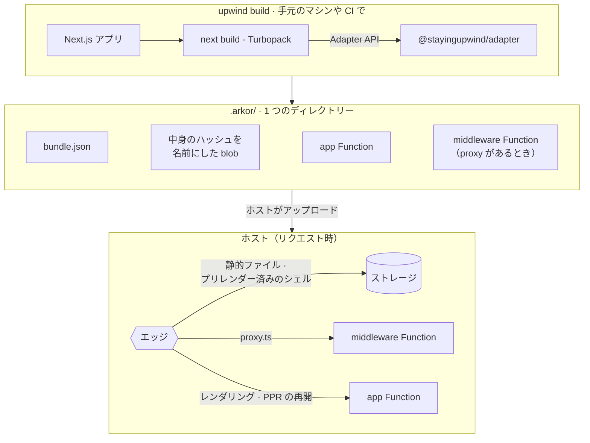
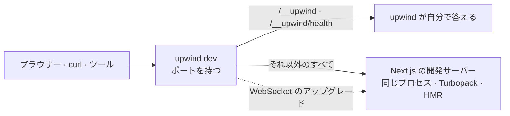

<div align="center">

<!-- Once www.stayingupwind.com is served, link the logo to its /ja page and add it to the links below. -->

<picture>
  <source media="(prefers-color-scheme: dark)" srcset=".github/assets/logo-dark.svg">
  
</picture>

# upwind

**Next.js のデプロイ用アダプターと、それが作ったものを配信するランタイム。**

いつもの`next build`が、ホストにデプロイするためのバンドルを1つ書き出します。ルーティング表、中身のハッシュを名前にしたすべてのプリレンダーと静的ファイル、そしてコードを動かす Function です。アプリは普通の Next.js のままです。

[](https://www.npmjs.com/package/upwind)
[](#-対応する-nextjs)
[](https://nodejs.org/ja)
[](#-ライセンス)
<br>
[](https://github.com/arkorlab/upwind/actions/workflows/ci.yaml)
[](https://github.com/arkorlab/upwind/actions/workflows/next-matrix.yaml)
[](https://www.npmjs.com/package/upwind#provenance)
[](#status)
[](CONTRIBUTING.md)

[クイックスタート](#-クイックスタート) · [なぜ upwind か](#-なぜ-upwind-なのか) · [Next.js との違い](#-nextjs-単体との違い) · [パッケージ](#-パッケージ) · [よくある質問](#-よくある質問) · [コントリビュート](#-コントリビュート)

[English](README.md) · **日本語**

</div>

<a id="status"></a>

> [!IMPORTANT]
> **upwind は 1.0 の前です。** デプロイ用バンドルは自身のバージョンを持ち、形が落ち着くまでは変わる前提です。どのリリースにも、1 つ前のマイナーバージョンとの互換レイヤーは含まれません。いちばん役に立つのは、私たちがまだ見たことのないビルドです。アプリで使っているのに upwind がまだ配信できないものを[教えてください](https://github.com/arkorlab/upwind/issues/new)。

## ✨ upwind とは

upwind は、Next.js アプリの周りで 2 つの仕事をします。`next build` の結果をデプロイできる形にすることと、開発サーバーの前に玄関を置くことです。玄関は同じポートで待ち受け、upwind 自身のパス（`/__upwind`）には自分で答え、それ以外のリクエストはすべて Next.js に渡します。

<table>
<tr>
<td width="33%" valign="top">

**🔨 `upwind build`**

Next.js の [Adapter API](https://nextjs.org/docs/app/api-reference/adapters) を通じて upwind のアダプターを差し込んだ、いつもの `next build` です。1 つのディレクトリーに、`bundle.json`、中身のハッシュを名前にしたプリレンダーと静的ファイルの blob、そしてアプリを配信するFunction（`app` と、`proxy.ts` か `middleware.ts` があれば `middleware`）を書き出します。

</td>
<td width="33%" valign="top">

**🚪 `upwind dev`**

いつもの Next.js の開発サーバー（Turbopack も HMR もエラーオーバーレイもそのまま）の前に、その玄関を置きます。`/__upwind` には玄関が自分で答えます。本番でプラットフォーム用のパスにエッジが答えるのと同じ役割です。

</td>
<td width="33%" valign="top">

**🌱 `pnpm create upwind`**

Tailwind 4 入りの Next.js 16 アプリを、両方のコマンドに配線した状態で書き出し、インストールして最初のコミットまで済ませます。テンプレートは 1 つなので、聞かれるのは置き場所だけです。

</td>
</tr>
</table>



> [!NOTE]
> **upwind はディレクトリーを書き出したところで止まります。** `.arkor/` をアップロードし、Function の前でエッジを動かすのは、デプロイを運用するプラットフォーム、つまりホストの仕事です。エッジはストレージからファイルを配信し、それ以外を Function に渡します。このリポジトリには、そのどちらを行うコードも含まれていません。ホストが実装するもの（バンドルのスキーマ、エッジが読むマニフェスト、エッジと Function が交わす `x-arkor-*` ヘッダー）は [`@stayingupwind/core`](packages/core) に定められています。

## 🎯 だれのためのものか

- **アプリを移植せずにデプロイ用バンドルを作りたいNext.jsのチーム。** App Router でも Pages Router でも、Partial Prerendering、`"use cache"`、Server Actions、`next/image`、`next/og`、WebAssembly を使っていても、いつもの `next build` でそのままビルドでき、ホストが配信します。
- **ビルドそのものを成果物にしたいチーム。** CI が作るのは、中身を読めて、差分を取れて、保管できる 1 つのディレクトリーで、ホストがデプロイするのもそのディレクトリーです。
- **Next.js を配信したいホストやプラットフォームの開発者。** バンドルはバージョン付きのスキーマ、エッジと Function のあいだのプロトコルは `x-arkor-*` ヘッダーの集まり、Function は [`@stayingupwind/runtime`](packages/runtime) から組み立てられます。`.next/` を読み解く必要はありません。

<details>
<summary><b>まだ向いていないケース</b></summary>

- **webpack でビルドしている、または独自の `cacheHandler` に頼っている。** どちらも対応していません。[配信できるもの](#-配信できるもの)を見てください。
- **1コマンドでアプリをビルドしてデプロイしたい。** upwind の役目は、バンドルを書き出すところまでです。上の注記を見てください。
- **1.0 相当の保証が必要。** [状態についての注記](#status)を見てください。

</details>

## 🚀 クイックスタート

**Node.js 24** 以降が必要です。コマンドは pnpm の例ですが、`create-upwind` は npm、Yarn、Bun でもインストールできます（下を参照）。

```bash
pnpm create upwind my-app
cd my-app
pnpm dev
```

```console
  upwind 0.3.0 dev
  - Local:     http://localhost:3000
  - Internal:  http://localhost:3000/__upwind

  ✓ Next.js 16.3.8 ready in 1127ms
```

<http://localhost:3000> を開いて、`app/page.tsx` を編集してみてください。いつもの Next.js の開発サーバーです。デプロイ用バンドルをビルドするには:

```bash
pnpm build   # upwind build: アダプターを差し込んだ、いつもの next build → バンドル
```

> [!TIP]
> <http://localhost:3000/__upwind> を開くと、この `upwind dev` の情報（各バージョン、アドレス、プロジェクトのディレクトリー、解決したアダプター）を確認できます。`/__upwind/health` は Next.js の準備ができたら `200`、それまでは `503` を返すので、サーバーの起動を待つスクリプトに使えます。

<details>
<summary><b>npm、Yarn、Bun を使う場合</b></summary>

```bash
npm create upwind@latest my-app
yarn create upwind my-app
bun create upwind my-app
```

依存パッケージは、`create upwind` を実行したパッケージマネージャーでインストールされます。別のものを使うなら `--use-npm`、`--use-pnpm`、`--use-yarn`、`--use-bun` のいずれかを付けてください。`--skip-install` はアプリを書き出すだけで何もインストールせず、`--no-git` は最初のコミットを作りません。

</details>

<details>
<summary><b><code>create-upwind</code> が書き出すもの</b></summary>

```
my-app
├── .gitignore
├── AGENTS.md          # Next.js 自身のエージェント向けルールを一字一句そのまま
├── CLAUDE.md
├── app/
│   ├── globals.css    # @import "tailwindcss";
│   ├── layout.tsx
│   └── page.tsx
├── next.config.ts     # adapterPath を設定。素の `next build` でも同じバンドルになる
├── package.json       # "dev": "upwind dev", "build": "upwind build"
├── postcss.config.mjs
├── tsconfig.json
└── README.md
```

`next`、`react`、`react-dom` はアプリ自身の依存です。`upwind` と `@stayingupwind/adapter` は、`create-upwind` 自身と同じバージョンで指定されます。ESLint も `src/` もコンポーネントライブラリもなく（形は `create-next-app --empty` と同じです）、`start` スクリプトも[意図して](#-よくある質問)置いていません。

</details>

### 既存のアプリに入れる

[対応範囲](#-対応する-nextjs)の Next.js を使い、Turbopack でビルドしていることが前提です。

1. CLI とアダプターをインストールします:

   ```bash
   pnpm add -D upwind @stayingupwind/adapter
   ```

2. `dev` と `build` のスクリプトを upwind のコマンドに置き換えます:

   ```json
   {
     "scripts": {
       "dev": "upwind dev",
       "build": "upwind build"
     }
   }
   ```

3. **推奨:** `next.config.ts` でも `adapterPath` を設定しておくと、素の `next build`（CI から、スクリプトから、upwind を知らない何からでも）が同じバンドルを書き出します:

   ```ts
   import { createRequire } from 'node:module';

   import type { NextConfig } from 'next';

   const config: NextConfig = {
     adapterPath: createRequire(import.meta.url).resolve('@stayingupwind/adapter'),
   };

   export default config;
   ```

   CommonJS の `next.config.js` なら、`require.resolve('@stayingupwind/adapter')` で同じことができます。同じアプリを Vercel にもデプロイするなら、`adapterPath` は環境変数 `VERCEL` が設定されていないときだけ指定してください。`next.config` で指定したアダプターは、Vercel 上のビルドでも使われてしまうからです。条件付きの書き方は [upwind の README](packages/upwind/README.md#on-vercel)（英語）にあります。

最後に、ビルドが書き出す `.arkor/` と、ローカルのストレージが置かれる `.upwind/` を `.gitignore` に加えてください。

## 💡 なぜ upwind なのか

<table>
<tr>
<td width="50%" valign="top">

**🧩 あなたの Next.js のまま。** フォークでも、独自の API で包むものでもありません。アダプターは Next.js の安定版 Adapter API に差し込まれ、`upwind dev` はプロジェクト自身の Next.js を玄関と同じプロセスで動かします。ページが upwind を import する必要はありません。

</td>
<td width="50%" valign="top">

**🔒 ビルドにアカウントも認証情報も不要。** アダプターはバンドルを書き出すあいだ、どのサービスとも通信しません。

</td>
</tr>
<tr>
<td valign="top">

**📦 内容でデプロイ。** プリレンダー済みのシェルと静的ファイルはすべて、中身のハッシュを名前にした blob です。変わっていないファイルはデプロイをまたいで同じ名前のままなので、ホストがアップロードし直す必要はありません。

</td>
<td valign="top">

**⚡ Partial Prerendering をストレージから。** エッジがルートのプリレンダー済みシェルをすぐに送り、Function は、ビルドがリクエスト時まで残しておいた動的な部分だけを送ります。同じシェルが 2 度送られることはありません。

</td>
</tr>
<tr>
<td valign="top">

**🚦 アプリを起こさずに済む middleware。** `proxy.ts` は独立した小さな Function としてもビルドされるので、エッジが先にそれを動かせます。リダイレクトや応答で済むリクエスト、ストレージ上のファイルへの rewrite で済むリクエストが、アプリを起動する必要はありません。

</td>
<td valign="top">

**🧮 WebAssembly のコンパイルは 1 度だけ。** `.wasm`はアップロード時にコンパイルされるモジュールとして送られるので、アプリの新しいインスタンスでも最初のリクエストでコンパイルし直す必要はありません。

</td>
</tr>
<tr>
<td valign="top">

**🛑 失敗はビルドの中で。** Function はすべて監査されます。サイズ上限を超えていないか、デプロイ先のランタイムが提供すると確認できていないimportはないか、`vm` の呼び出しがバンドルに残っていないか、バンドラーがたどれない読み込みはないか。アップロードで発覚する前に、ビルドが失敗して理由を知らせます。

</td>
<td valign="top">

**🔭 毎日 Next.js と照らし合わせる。** Adapter API だけでは足りない箇所では、アダプターが Next.js 自身の出力にパッチを当てています。そのパッチを毎日、対応範囲の最古のリリースから canary まで、実際の Next.js に対して検査しています。[詳しくは下へ](#-対応する-nextjs)。

</td>
</tr>
<tr>
<td valign="top">

**🩺 何も動かないときにも答える。** `/__upwind` に答えるのはアプリではなく玄関なので、アプリのコンパイル中も、そのコンパイルが失敗している最中も応答します。

</td>
<td valign="top">

**🔏 検証できるリリース。** どのリリースも CI が `main` 上の署名付きタグから公開し、すべてのパッケージに npm の provenance が付いています。

</td>
</tr>
<tr>
<td valign="top">

**💾 設定のいらないストレージ**<br>
D1 データベース、KV 名前空間、R2 バケットを、デプロイと同じランタイムの上でローカルに動かし、`import db from '@stayingupwind/sdk/db'` で読めます。[詳しくは下へ](#-ストレージ)。

</td>
<td valign="top">

**🤖 コーディングエージェントに対応**<br>
新しいプロジェクトには Next.js 自身の `AGENTS.md` と `CLAUDE.md` が入り、`next dev` と同じように最新の状態に保たれます。[詳しくは FAQ へ](#-よくある質問)。

</td>
</tr>
</table>

## 🆚 Next.js 単体との違い

**upwind は Next.js を置き換えません。あなたの Next.js を動かします。** フレームワークのコピーは持たず、`upwind dev` も `upwind build` もプロジェクトが依存する Next.js を使い、それがなければ起動を拒みます。変わるのはアプリを取り囲むもの、つまり開発中の玄関と、本番でビルドが何になるかです。

|                                               | Next.js 単体                                       | upwind と組み合わせた Next.js                                                                                                                                                                                           |
| --------------------------------------------- | -------------------------------------------------- | ----------------------------------------------------------------------------------------------------------------------------------------------------------------------------------------------------------------------- |
| **あなたのコード**                            | App Router、Pages Router、`next.config`            | **同じです。** [対応していないもの](#-配信できるもの)を除けば移植は不要で、upwind から import しなければならないものもありません                                                                                        |
| **開発**                                      | `next dev`                                         | `upwind dev`: 同じ開発サーバーを同じプロセスで。その前に `/__upwind` に答える玄関があります                                                                                                                             |
| **ビルド**                                    | `next build` → `.next/`                            | `upwind build`: 同じ `next build`。そのアダプターが `.arkor/` も書き出します                                                                                                                                            |
| **本番**                                      | `next start`: 常駐する 1 つの Node.js サーバー     | 自前のサーバーはなし。`app` Function（1 つに収まらない大きなアプリは、ホストが分割する場合、ルートが共有するコードに沿って複数に分かれます。proxy があれば `middleware` Function も）が、ホストのエッジの後ろで動きます |
| **静的ファイルとプリレンダー**                | そのサーバーが配信                                 | 中身のハッシュを名前にした blob を、エッジがストレージから配信                                                                                                                                                          |
| **Partial Prerendering**                      | サーバーがシェルを送り、続けて残りをストリーミング | エッジがストレージからシェルを送り、Function は動的な部分だけを送る                                                                                                                                                     |
| **middleware / `proxy.ts`**                   | サーバーの中で動く                                 | 独立した Function にもなり、エッジがアプリを起こす前に動かせる                                                                                                                                                          |
| **`/_next/image`**                            | サーバーが最適化                                   | エッジが最適化                                                                                                                                                                                                          |
| **キャッシュ**（ISR、`"use cache"`、`fetch`） | メモリーとディスク、または自作の `cacheHandler`    | ホストが保持。キャッシュのモジュールはビルド時に指定し、既定のアダプターで作ったバンドルは何もキャッシュしません                                                                                                        |
| **cron ジョブ**                               | —                                                  | `upwind.config.ts` か `vercel.json` の `crons`。ビルド時に検査されます                                                                                                                                                  |
| **ローカルのストレージ**                      | —                                                  | `.upwind/` 以下の D1、KV、R2 を `@stayingupwind/sdk` で読む                                                                                                                                                             |
| **バンドラー**                                | Turbopack か webpack                               | Turbopack                                                                                                                                                                                                               |

**やめるときは差分 1 つ。** `package.json` のスクリプトを `next dev` と `next build` に戻し、2 つの devDependencies と `adapterPath` の行を消してください。置き換えが要るのは、`@stayingupwind/sdk` でストレージを読んでいるコードと、`upwind.config.*` に書いた cron だけです。

<details>
<summary><b><code>upwind dev</code> は <code>next dev</code> をどう包んでいるか</b></summary>



upwind が待ち受け、Next.js はその後ろの同じプロセスで、Next.js がカスタムサーバー向けに文書化しているやり方で起動されます。2 つ目のサーバーも、あいだのプロキシもありません。Next.js 自身の親プロセスがすることは `upwind dev` もします。バナーを表示し、`next.config` が変わったときや、エラーオーバーレイの再起動ボタンが押されたときには、サーバーを起動し直します。

`--port` と `--hostname` 以外の `next dev` のフラグ（`--experimental-https`、`--inspect`、`--turbopack`、`--webpack`）は、黙って無視せずに拒否します。また `/__upwind/…` へのリクエストは、内側から Next.js のルーターに届くこともあります（そこへ rewrite する middleware や、Next.js が自分自身に送るリクエスト）。そのためアダプターがインストールされていれば、Next.js のルーターでもアプリのルートより先にこのプレフィックスを予約し、catch-all ルートが答えてしまわないようにします。素の `next dev` では、送り先の玄関がないので何も予約しません。

</details>

## 🧰 配信できるもの

|     | 機能                                                                        | 補足                                                                   |
| :-: | --------------------------------------------------------------------------- | ---------------------------------------------------------------------- |
| ✅  | App Router: Server Components、ストリーミング、Server Actions               |                                                                        |
| ✅  | Partial Prerendering、Cache Components                                      | シェルはストレージから、残りは Function から                           |
| ✅  | `"use cache"`、ISR、`revalidateTag` / `updateTag`、キャッシュされた `fetch` | ビルド時に指定したホストのキャッシュモジュールが保持（下を参照）       |
| ✅  | Pages Router: `getStaticProps`、`getServerSideProps`、API ルート            | クライアントのルーターが要求する `_next/data` も                       |
| ✅  | `proxy.ts` と、非推奨の `middleware.ts`                                     | 独立した Function にもなる                                             |
| ✅  | `export const runtime = 'edge'` のルート                                    | ビルド時の出力をそのまま配信するか、リクエストごとに全体をレンダリング |
| ✅  | `next/image`                                                                | エッジで最適化                                                         |
| ✅  | `next/og`                                                                   | 静的なルートならビルドが、動的なルートなら Function が描く             |
| ✅  | WebAssembly                                                                 | アップロード時に 1 度だけコンパイル                                    |
| ✅  | `instrumentation.ts`、Draft Mode                                            |                                                                        |
| ✅  | `basePath`、`trailingSlash`、`i18n`                                         |                                                                        |
| ✅  | 静的エクスポート（`output: 'export'`）                                      | 同じバンドルを、サーバー側を空にして                                   |
| ✅  | cron ジョブ                                                                 | [`next.config` の隣で宣言](#-定期実行)                                 |

**キャッシュはホストのもので、ビルド時に決まります。** ランタイムはキャッシュの読み書きをすべて、ホストが独自のアダプター（`createAdapter({ cacheHostModule })`）で指定したモジュールに渡します。上の手順で使う既定のアダプターは何も指定しないので、そのバンドルはビルドが作ったものを配信し、再検証は行いません。

<details>
<summary><b>対応していないもの</b></summary>

- **webpack でのビルド。** Turbopack のみです。静的エクスポートはビルドされたコードを含まないので、どのバンドラーのものでも受け付けます。
- **独自の `cacheHandler` / `cacheHandlers`。** 意図してビルドを失敗させます。ISR 用の incremental cache と `"use cache"` のハンドラーはホストが用意します。ハンドラーを動かさない静的エクスポートだけは例外です。
- **edge ランタイムのルートの再検証。** その出力は、ビルド時のものをそのまま配信するか、リクエストごとに全体をレンダリングします。
- **`experimental.optimizeCss`。** ビルドしたスタイルシートを、Function にはないディスクから読もうとします。それが必要な最初のレンダリングが、理由を示して失敗します。
- **`partialFallback`。** バンドルに記録はしますが、それに基づいては動きません。
- **`experimental.runtimeServerDeploymentId`。**

アダプターの README（英語）に、[Next.js から読むすべてのフィールド](packages/adapter/README.md)と、それがバンドルで何になるかの一覧があります。Next.js の出力に当てるパッチの一覧は [`packages/adapter/src/patches/index.ts`](packages/adapter/src/patches/index.ts) にあります。

</details>

## 💾 ストレージ

アプリは設定を 1 行も書かずに、D1 データベース、KV 名前空間、R2 バケットを使えます。ローカルでは `upwind dev` と `upwind build` が、それらを動かし、データを `.upwind/` に保存して、アプリに提供します。本番では、ホストが割り当てたストレージを Function がアプリに提供します。SDK は、提供されたものをどちらでも同じやり方で読みます。

```tsx
import db from '@stayingupwind/sdk/db';

export default async function Page() {
  const { results } = await db
    .prepare('select id, title from posts order by id desc')
    .all<{ id: number; title: string }>();

  return (
    <ul>
      {results.map((post) => (
        <li key={post.id}>{post.title}</li>
      ))}
    </ul>
  );
}
```

| import                                       | 説明                                                                |
| -------------------------------------------- | ------------------------------------------------------------------- |
| `import db from '@stayingupwind/sdk/db'`     | プロジェクトの D1 データベース（提供されているのが 1 つだけのとき） |
| `import kv from '@stayingupwind/sdk/kv'`     | プロジェクトの KV 名前空間（同上）                                  |
| `import blob from '@stayingupwind/sdk/blob'` | プロジェクトの R2 バケット（同上）                                  |
| `d1(name)`、`kv(name)`、`blob(name)`         | バインドされた名前で指定するストレージ                              |
| `published()`                                | 提供されているすべてと、その名前                                    |

- **1 種類に 1 つなら、名前はいりません。** 提供されている D1 データベースが 1 つだけなら、`db` はそのデータベースを指します。複数あるときは例外を投げて一覧を示すので、`d1('ORDERS')` のように使いたいものを選んでください。
- **SDKはストレージの型を同梱します。** `@cloudflare/workers-types`の`D1Database`、`KVNamespace`、`R2Bucket`を使うために、プロジェクトの`tsconfig`で何かを設定する必要はありません。
- **プリレンダー中にも読めます。** SDK をインストールしたプロジェクトでは、`upwind build` がページのプリレンダー中にも同じストレージを提供するので、`generateStaticParams` がスラッグを D1 から読み出せます。そのときプリレンダーは、複数ではなく 1 つのビルドワーカーで行われます。ストレージのディレクトリーを開けるのは、一度に 1 つのランタイムだけだからです。ただしプロジェクトが `experimental.cpus` を自分で指定している場合はその値が使われ、ストレージを読むページは 1 つを除くすべてのワーカーで失敗します。素の `next build` は何も提供せず、SDK は推測で動かずに、その旨をエラーで伝えます。
- **空から始め直すなら `.upwind/` を消してください。** ローカルだけのデータで、デプロイ先から読まれることはありません。

## ⏰ 定期実行

```ts
// upwind.config.ts（next.config.ts の隣に置く）
export default {
  crons: [{ path: '/api/nightly', schedule: '0 3 * * *' }],
};
```

アダプターは、`next.config` の隣にある `upwind.config.ts`、`upwind.jsonc`、`upwind.json`、`vercel.json` をこの順に探し、最初に見つかった 1 つだけを読みます（ファイルは統合しません）。そのため、`crons` を宣言済みの `vercel.json` はそのまま使えます。スケジュールはすべて Vercel の書式（5 つのフィールド、UTC、`@daily` は不可）で検査されます。実行できないものが 1 つでもあればファイル名を示してビルドを失敗させ、受け付けたものは、ホストが予定どおり実行できるようバンドルに載せます。

## 📦 パッケージ

| パッケージ                                   | バージョン                                                                                                                                                 | 説明                                                                                                 |
| -------------------------------------------- | ---------------------------------------------------------------------------------------------------------------------------------------------------------- | ---------------------------------------------------------------------------------------------------- |
| [`upwind`](packages/upwind)                  | [](https://www.npmjs.com/package/upwind)                                                 | CLI。`upwind dev` と `upwind build`                                                                  |
| [`create-upwind`](packages/create-upwind)    | [](https://www.npmjs.com/package/create-upwind)                            | `pnpm create upwind` と、それが書き出すアプリ                                                        |
| [`@stayingupwind/adapter`](packages/adapter) | [](https://www.npmjs.com/package/@stayingupwind/adapter) | `next build` の中で動き、バンドルを書き出し、それを配信する Function を組み立てる                    |
| [`@stayingupwind/runtime`](packages/runtime) | [](https://www.npmjs.com/package/@stayingupwind/runtime) | デプロイされた Function が動かすコード。アダプターが組み込むもので、手でインストールするものではない |
| [`@stayingupwind/core`](packages/core)       | [](https://www.npmjs.com/package/@stayingupwind/core)          | 契約そのもの。バンドルのスキーマ、キャッシュの用語、リクエストの分類、エッジと Function のプロトコル |
| [`@stayingupwind/sdk`](packages/sdk)         | [](https://www.npmjs.com/package/@stayingupwind/sdk)             | アプリが自分の D1、KV、R2 を設定なしで読むためのもの                                                 |
| [`@stayingupwind/auth`](packages/auth)       | [](https://www.npmjs.com/package/@stayingupwind/auth)          | Better Auth を設定なしで — OAuth プロバイダーが手元にない間は、それも含めて                          |

アプリが依存するのはこのうち 2 つ、`upwind` と `@stayingupwind/adapter` です（ストレージを読むなら SDK も、サインインさせるなら auth も）。すべてのパッケージは 1 つのバージョンを共有し、新しいプロジェクトは `create-upwind` 自身のバージョン（`^x.y.z`）でそれらを指定するので、プロジェクトを作るものと動かすものは、同じ世代から始まります。

## 📐 対応する Next.js

公開済みのリリースが対応するのは **Next.js 16.2 以降の 16 系** です（冒頭の Next.js バッジは、この範囲を npm から読み取って表示しています）。16.2 は Next.js の Adapter API が安定版になったバージョンで、それより前には形の違う実験的なフックしかないため、対応するには別のアダプターが必要です。

Adapter API だけでは足りない箇所では、アダプターが Next.js 自身の出力にパッチを当てます。パッチは [`packages/adapter/src/patches/`](packages/adapter/src/patches) の下にあり、どれもバージョン番号を当てにせず、実際の Next.js に対して検査しています:

| 検査                        | いつ                                     | 何を確かめるか                                                                                                   |
| --------------------------- | ---------------------------------------- | ---------------------------------------------------------------------------------------------------------------- |
| `pnpm check:patches`        | すべてのプルリクエスト                   | Next.js の公開パッケージへのパッチが、このリポジトリがビルドに使う Next.js で、狙った箇所を今も見つけられるか    |
| `pnpm check:patches:range`  | 毎日                                     | 同じことを、対応範囲のすべてのリリースについて                                                                   |
| `pnpm check:matrix`         | 毎日（対応範囲の最古と最新のリリースで） | [フィクスチャー](fixtures)を実際に `next build` する。ビルドが _書き出すもの_ へのパッチを検査できるのはこれだけ |
| `pnpm check:patches:canary` | 毎日（失敗は許容）                       | canary。次の Next.js が何を変えようとしているかの予報（毎日のマトリクスでも canary をビルドする）                |

## ❓ よくある質問

<details>
<summary><b><code>next dev</code> や <code>next build</code> は引き続き使えますか？</b></summary>

使えます。upwind が動かしているのはプロジェクト自身の Next.js だからです。`next.config` に `adapterPath` を設定していれば、素の `next build` も `upwind build` と同じバンドルを書き出します（プリレンダー中にストレージを読むページだけは例外です。[ストレージ](#-ストレージ)を参照）。素の `next dev` は、いつもどおりアプリを配信します。ただ玄関がないので、`/__upwind` はありません。

</details>

<details>
<summary><b><code>start</code> スクリプトがないのはなぜですか？</b></summary>

デプロイ先で `start` スクリプトが実行されることはないからです。アプリを配信するのはバンドル（エッジの後ろで動くFunction）であって、プロジェクト自身の Node.js サーバーではありません。

</details>

<details>
<summary><b><code>/__upwind</code> は誰が読めますか？</b></summary>

開発サーバーの玄関で、次の 4 つのルールを守ります。

- `GET` と `HEAD` のみ。
- `access-control-allow-origin` を付けないので、ほかのオリジンからリクエストは送れても、レスポンスは読めません。
- `cache-control: no-store`。
- リクエストが名乗るホスト名がすべて、IP アドレス、`localhost` か `*.localhost`、`--hostname` で指定した名前のいずれかのときだけ答えます。そのため、DNS リバインディングを使うページが同一オリジンを装って、プロジェクトがディスク上のどこにあるかを読み取ることはできません。

ただし `next dev` と同じく、指定しなければすべてのネットワークインターフェースで待ち受けるので、このポートに届く人なら誰でも読めます（`projectDir` も含めて）。このマシンだけに限るなら `-H localhost` を付けてください。

</details>

<details>
<summary><b>新しいプロジェクトに <code>AGENTS.md</code> と <code>CLAUDE.md</code> があるのはなぜですか？</b></summary>

Next.js 自身のものを、一字一句そのまま使っています。コーディングエージェントに、この Next.js は学習したものより新しいこと、コードを書く前に `node_modules/next/dist/docs/` のドキュメントを読むことを伝えるブロックです。`create-upwind` は `create-next-app` と同じようにこれらを書き、コーディングエージェントが `upwind dev` を動かすと、Next.js がこれらを最新にします。`--no-agents-md` を付けるとスキャフォールドには含めませんが、エージェントが最初に `upwind dev` を動かしたときに、`next dev` と同じく書き出されます。ずっと止めておくスイッチは `next.config` の `agentRules: false` で、`upwind dev` も `next dev` もこれに従います。

</details>

## 🤝 コントリビュート

Issue も質問もプルリクエストも歓迎します。荒削りなものでも構いません。リポジトリの構成、スタイル、リリースの作り方は [CONTRIBUTING.md](CONTRIBUTING.md)（英語）にあります。

| 使える時間       | いちばん助かること                                                                                                                                                                                          |
| ---------------- | ----------------------------------------------------------------------------------------------------------------------------------------------------------------------------------------------------------- |
| **5 分**         | [アダプターが読むもの](packages/adapter/README.md)（英語）を読んで、間違い、抜け、アプリには当てはまるのに文書には書かれていないことがあれば、[Issue を開く](https://github.com/arkorlab/upwind/issues/new) |
| **午後いっぱい** | 小さなプルリクエストを送る。わかりやすいエラーメッセージ、そのコードが防いでいる失敗を名指すコメント、ドキュメントの修正                                                                                    |
| **継続的に**     | アプリで使っているのに、upwind がまだ配信できないものを教える                                                                                                                                               |

Node 24（リポジトリの指定は 24.21.0）が必要です。pnpm は、リポジトリが固定したバージョンを Corepack が取ってきます。

```bash
corepack enable        # マシンごとに 1 度だけ。Corepack は Node 24 に同梱されている
git clone https://github.com/arkorlab/upwind.git
cd upwind
pnpm install

pnpm typecheck
pnpm lint
pnpm format
pnpm knip
pnpm build
pnpm check:patches
pnpm check:deploy-tests
pnpm check:agent-rules
```

最後の 8 つが、CI が実行するもののすべてで、順番も同じです。CI は `pnpm lint` に 8 GB のヒープを与えているので（`NODE_OPTIONS=--max-old-space-size=8192`）、手元でも同じ設定が必要になることがあります。

> [!CAUTION]
> **セキュリティの問題を見つけたら**、公開の Issue ではなく [security@arkor.ai](mailto:security@arkor.ai) にメールしてください。48 時間以内に受領をお知らせします。

<a href="https://github.com/arkorlab/upwind/graphs/contributors">
  
</a>

## 📄 ライセンス

[MIT ライセンス](LICENSE-MIT)と [Apache License, Version 2.0](LICENSE-APACHE) のどちらかを選んで利用できます。Next.js から取り込んでいるものと、その条件は [NOTICE](NOTICE) にあります。

---

<div align="center">
  <sub><a href="https://github.com/arkorlab">Arkor</a> とコントリビューターが作っています · <a href="#upwind">トップへ戻る ↑</a></sub>
</div>
