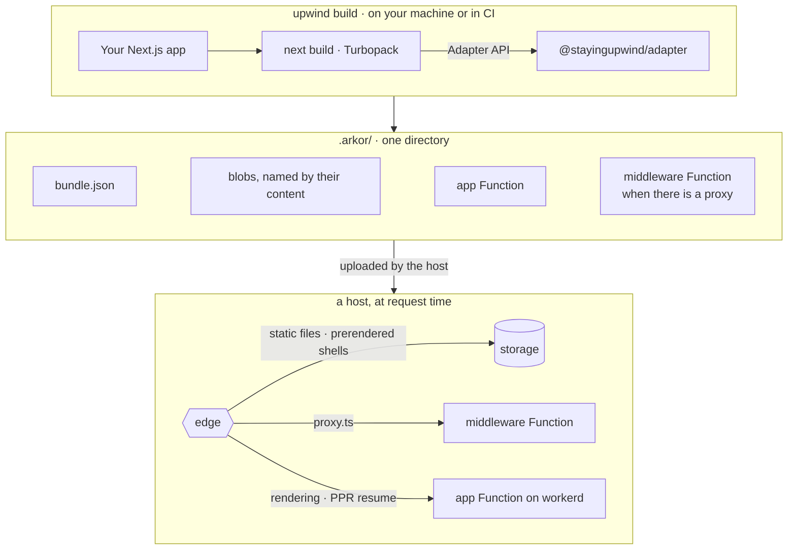
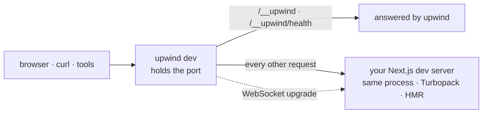

<div align="center">

<!-- Once www.stayingupwind.com is served, link the logo to it and add it to the links below. -->

<picture>
  <source media="(prefers-color-scheme: dark)" srcset=".github/assets/logo-dark.svg">
  
</picture>

# upwind

**A Next.js deployment adapter, and the runtime that serves what it builds.**

Your own `next build` writes one deployment bundle for a host to run on Cloudflare Workers: the routing tables, every prerender and static file named by a hash of its content, and the Functions that run your code. Your app stays plain Next.js.

[](https://www.npmjs.com/package/upwind)
[](#-which-nextjs)
[](https://nodejs.org/)
[](https://developers.cloudflare.com/workers/)
[](#-license)
<br>
[](https://github.com/arkorlab/upwind/actions/workflows/ci.yaml)
[](https://github.com/arkorlab/upwind/actions/workflows/next-matrix.yaml)
[](https://www.npmjs.com/package/upwind#provenance)
[](#status)
[](CONTRIBUTING.md)

[Quick start](#-quick-start) · [Why upwind](#-why-upwind) · [vs. Next.js](#-upwind-and-nextjs) · [Packages](#-packages) · [FAQ](#-faq) · [Contributing](#-contributing)

**English** · [日本語](README.ja.md)

</div>

<a id="status"></a>

> [!IMPORTANT]
> **upwind is before 1.0.** The deployment bundle carries a version of its own and its shape is expected to change before it settles, and no release keeps a compatibility layer for the previous minor version. The most useful thing you can send is a build we have never seen: [tell us](https://github.com/arkorlab/upwind/issues/new) what your app does that upwind does not serve yet.

## ✨ What is upwind?

upwind does two jobs around your Next.js app: it turns `next build` into a deployment, and it puts a front door in front of the dev server — a thin layer on the same port that answers upwind's own `/__upwind` paths and hands every other request to Next.js.

<table>
<tr>
<td width="33%" valign="top">

**🔨 `upwind build`**

Your own `next build`, with upwind's adapter plugged in through Next.js's [Adapter API](https://nextjs.org/docs/app/api-reference/adapters). It writes one directory: a `bundle.json`, every prerender and static file as a blob named by its hash, and the Functions for workerd, the runtime behind Cloudflare Workers — `app`, plus `middleware` when the project has a `proxy.ts` or `middleware.ts`.

</td>
<td width="33%" valign="top">

**🚪 `upwind dev`**

Your own Next.js dev server — the same Turbopack, HMR and error overlay — behind that front door, which answers `/__upwind` the way a deployment's edge answers the platform's own paths.

</td>
<td width="33%" valign="top">

**🌱 `pnpm create upwind`**

A Next.js 16 app with Tailwind 4, wired to both commands, installed, and committed. There is one template, so the only question it asks is where to put the app.

</td>
</tr>
</table>



> [!NOTE]
> **upwind stops at the directory.** Uploading `.arkor/` and running the edge in front of its Functions is the job of a host, the platform that runs the deployment; the edge serves files from storage and passes everything else to the Functions. Nothing in this repository does either. What a host implements — the bundle's schema, the manifest an edge reads, and the `x-arkor-*` headers an edge and a Function exchange — is specified in [`@stayingupwind/core`](packages/core).

## 🎯 Who it's for

- **Next.js teams who want their app built for Cloudflare Workers** without porting it: App Router or Pages Router, Partial Prerendering and `"use cache"`, Server Actions, `next/image`, `next/og`, WebAssembly — built by the `next build` you already run, and served by a host.
- **Teams who want the build to be the artifact.** CI produces one directory you can inspect, diff and keep, and that directory is what a host deploys.
- **Hosts and platform builders who want to serve Next.js.** The bundle is a versioned schema, the edge ↔ Function protocol is a set of `x-arkor-*` headers, and the Functions are built from [`@stayingupwind/runtime`](packages/runtime) — nothing to reverse-engineer out of `.next/`.

<details>
<summary><b>Not a fit yet if…</b></summary>

- **you build with webpack, or rely on a custom `cacheHandler`.** Neither is supported; see [what it serves](#-what-it-serves).
- **you want one command that deploys to your own Cloudflare account.** upwind stops at the bundle; see the note above.
- **you need 1.0 guarantees.** See [the status note](#status).

</details>

## 🚀 Quick start

You need **Node.js 24** or later. The commands use pnpm; `create-upwind` also installs with npm, Yarn or Bun (below).

```bash
pnpm create upwind my-app
cd my-app
pnpm dev
```

```console
  upwind 0.3.0 dev
  - Local:     http://localhost:3000
  - Internal:  http://localhost:3000/__upwind

  ✓ Next.js 16.3.7 ready in 1127ms
```

Open <http://localhost:3000> and edit `app/page.tsx` — it is the Next.js dev server you already know. To build the deployment bundle:

```bash
pnpm build   # upwind build: your own next build, with the adapter plugged in → the bundle
```

> [!TIP]
> Open <http://localhost:3000/__upwind> to see what upwind knows about the run: the versions, the address, the project directory, and the adapter it resolved. `/__upwind/health` answers `200` once Next.js is ready and `503` until then, for a script that waits for the server.

<details>
<summary><b>With npm, Yarn or Bun</b></summary>

```bash
npm create upwind@latest my-app
yarn create upwind my-app
bun create upwind my-app
```

Dependencies are installed with the package manager you ran `create upwind` with; `--use-npm`, `--use-pnpm`, `--use-yarn` or `--use-bun` picks another. `--skip-install` writes the app and installs nothing, and `--no-git` skips the first commit.

</details>

<details>
<summary><b>What <code>create-upwind</code> writes</b></summary>

```
my-app
├── .gitignore
├── AGENTS.md          # Next.js's own agent rules, word for word
├── CLAUDE.md
├── app/
│   ├── globals.css    # @import "tailwindcss";
│   ├── layout.tsx
│   └── page.tsx
├── next.config.ts     # sets adapterPath, so a plain `next build` writes the same bundle
├── package.json       # "dev": "upwind dev", "build": "upwind build"
├── postcss.config.mjs
├── tsconfig.json
└── README.md
```

`next`, `react` and `react-dom` are the app's own dependencies, and `upwind` and `@stayingupwind/adapter` are asked for at `create-upwind`'s own version. There is no ESLint, no `src/` and no component library — `create-next-app --empty` is the shape — and no `start` script, [on purpose](#-faq).

</details>

### Add upwind to an existing app

Your app needs Next.js in [the supported range](#-which-nextjs), built with Turbopack.

1. Install the CLI and the adapter:

   ```bash
   pnpm add -D upwind @stayingupwind/adapter
   ```

2. Point the `dev` and `build` scripts at upwind:

   ```json
   {
     "scripts": {
       "dev": "upwind dev",
       "build": "upwind build"
     }
   }
   ```

3. **Recommended:** set `adapterPath` in `next.config.ts` too, so that a plain `next build` — from CI, a script, anything that has never heard of upwind — writes the same bundle:

   ```ts
   import { createRequire } from 'node:module';

   import type { NextConfig } from 'next';

   const config: NextConfig = {
     adapterPath: createRequire(import.meta.url).resolve('@stayingupwind/adapter'),
   };

   export default config;
   ```

   In a CommonJS `next.config.js`, `require.resolve('@stayingupwind/adapter')` does the same. If the same app also deploys to Vercel, set `adapterPath` only when the `VERCEL` environment variable is unset: an adapter named in `next.config` takes over the build on Vercel too. [upwind's readme](packages/upwind/README.md#on-vercel) shows the conditional form.

Then add `.arkor/`, which a build writes, and `.upwind/`, where local storage is kept, to `.gitignore`.

## 💡 Why upwind

<table>
<tr>
<td width="50%" valign="top">

**🧩 It is still your Next.js.** No fork and no wrapper API: the adapter plugs into Next.js's stable Adapter API, and `upwind dev` runs your project's own Next.js in the same process as its front door. Nothing in your pages has to import upwind.

</td>
<td width="50%" valign="top">

**🔒 Builds need no account and no credentials.** The adapter calls no service while it writes the bundle, Cloudflare included.

</td>
</tr>
<tr>
<td valign="top">

**📦 Deploys by content.** Every prerendered shell and static file is a blob named by a hash of its content, so a file that did not change keeps its name from one deploy to the next, and a host need not upload it again.

</td>
<td valign="top">

**⚡ Partial Prerendering from storage.** The edge sends a route's prerendered shell at once, and the Function sends only the dynamic part the build left for request time — no visitor is sent the shell twice.

</td>
</tr>
<tr>
<td valign="top">

**🚦 Middleware that need not wake your app.** `proxy.ts` is also built as a small Function of its own, so an edge can run it first: a request it redirects, answers, or rewrites to a file in storage need never start the application.

</td>
<td valign="top">

**🧮 WebAssembly, compiled once.** A `.wasm` ships as a module Cloudflare compiles at upload, not as bytes every isolate compiles again on its first request.

</td>
</tr>
<tr>
<td valign="top">

**🛑 Fails in the build, not after it.** Every Function is audited — over Cloudflare's size limit, an import the Workers runtime is not known to provide, a `vm` call left in the bundle, a load the bundler could not follow — and the build fails and says why before an upload would.

</td>
<td valign="top">

**🔭 Held to Next.js every day.** Where the Adapter API is not enough, the adapter patches Next.js's own output, and every patch is checked daily against real Next.js releases, from the oldest supported to the canary. [How](#-which-nextjs).

</td>
</tr>
<tr>
<td valign="top">

**🩺 Answers when nothing else does.** `/__upwind` is answered by the front door, not by your application, so it responds while the app compiles — and while its compile fails.

</td>
<td valign="top">

**🔏 Releases you can verify.** Every release is published by CI from a signed tag on `main`, and every package carries an npm provenance attestation.

</td>
</tr>
<tr>
<td valign="top">

**💾 Storage with nothing to configure**<br>
A D1 database, a KV namespace and an R2 bucket, run locally on the runtime a deployment uses and read with `import db from '@stayingupwind/sdk/db'`. [More below](#-storage).

</td>
<td valign="top">

**🤖 Ready for coding agents**<br>
New projects get Next.js's own `AGENTS.md` and `CLAUDE.md`, and `upwind dev` keeps them current the way `next dev` does. [More in the FAQ](#-faq).

</td>
</tr>
</table>

## 🆚 upwind and Next.js

**upwind does not replace Next.js — it runs yours.** It carries no copy of the framework: `upwind dev` and `upwind build` use the Next.js your project depends on, and refuse to start without one. What changes is what surrounds your app — the front door in development, and what a build becomes in production.

|                                         | Next.js on its own                                   | Next.js with upwind                                                                                                        |
| --------------------------------------- | ---------------------------------------------------- | -------------------------------------------------------------------------------------------------------------------------- |
| **Your code**                           | App Router, Pages Router, `next.config`              | **The same.** Nothing to port beyond [what is not supported](#-what-it-serves), and nothing you have to import from upwind |
| **Development**                         | `next dev`                                           | `upwind dev`: the same dev server, in the same process, behind a front door that answers `/__upwind`                       |
| **Build**                               | `next build` → `.next/`                              | `upwind build`: the same `next build`, whose adapter also writes `.arkor/`                                                 |
| **Production**                          | `next start`: one long-running Node.js server        | No server of your own: an `app` Function on workerd, and a `middleware` one when there is a proxy, behind a host's edge    |
| **Static files and prerenders**         | Served by that server                                | Blobs named by content, served from storage by the edge                                                                    |
| **Partial Prerendering**                | The server sends the shell, then streams the rest    | The edge sends the shell from storage; the Function sends only the dynamic part                                            |
| **Middleware / `proxy.ts`**             | Runs inside the server                               | Also a Function of its own, which an edge can run before waking the application                                            |
| **`/_next/image`**                      | Optimized by the server                              | Optimized by the edge                                                                                                      |
| **Cache** (ISR, `"use cache"`, `fetch`) | In memory and on disk, or a `cacheHandler` you write | Kept by the host, through a cache module named when the bundle is built; with the default adapter, a bundle caches nothing |
| **Cron jobs**                           | —                                                    | `crons` in `upwind.config.ts` or `vercel.json`, checked at build time                                                      |
| **Local storage**                       | —                                                    | D1, KV and R2 under `.upwind/`, read through `@stayingupwind/sdk`                                                          |
| **Bundler**                             | Turbopack or webpack                                 | Turbopack                                                                                                                  |

**Leaving takes one diff.** Put `next dev` and `next build` back in `package.json`, and remove the two devDependencies and the `adapterPath` line. What you would have to replace is code that reads storage through `@stayingupwind/sdk`, and any crons in `upwind.config.*`.

<details>
<summary><b>How <code>upwind dev</code> wraps <code>next dev</code></b></summary>



upwind listens, and Next.js runs in the same process behind it, started the way Next.js documents a custom server — so there is no second server and no proxy hop in between. What Next.js's own parent process does, `upwind dev` does too: it prints the banner, and starts the server again when `next.config` changes or the error overlay's restart button is pressed.

Apart from `--port` and `--hostname`, `next dev`'s flags — `--experimental-https`, `--inspect`, `--turbopack`, `--webpack` — are refused rather than quietly ignored. A request for `/__upwind/…` can also reach Next.js's router from inside — a middleware that rewrites to it, a request Next.js makes of itself — so the adapter, when it is installed, reserves the prefix in Next.js's router too, before any of your routes are matched, and a catch-all route of yours cannot answer it. Under a plain `next dev`, with no front door to send it to, nothing is reserved.

</details>

## 🧰 What it serves

|     | Feature                                                           | Notes                                                             |
| :-: | ----------------------------------------------------------------- | ----------------------------------------------------------------- |
| ✅  | App Router: Server Components, streaming, Server Actions          |                                                                   |
| ✅  | Partial Prerendering, Cache Components                            | the shell from storage, the rest from the Function                |
| ✅  | `"use cache"`, ISR, `revalidateTag` / `updateTag`, cached `fetch` | kept by a host's cache module, named at build time (below)        |
| ✅  | Pages Router: `getStaticProps`, `getServerSideProps`, API routes  | including the `_next/data` outputs the client router asks for     |
| ✅  | `proxy.ts`, and the deprecated `middleware.ts`                    | also a Function of its own                                        |
| ✅  | Routes with `export const runtime = 'edge'`                       | served as built, or rendered in full on each request              |
| ✅  | `next/image`                                                      | optimized at the edge                                             |
| ✅  | `next/og`                                                         | drawn by the build, or by the Function where the route is dynamic |
| ✅  | WebAssembly                                                       | compiled once, at upload                                          |
| ✅  | `instrumentation.ts`, Draft Mode                                  |                                                                   |
| ✅  | `basePath`, `trailingSlash`, `i18n`                               |                                                                   |
| ✅  | Static export (`output: 'export'`)                                | the same bundle, with the server parts empty                      |
| ✅  | Cron jobs                                                         | [declared beside `next.config`](#-scheduled-work)                 |

**The cache is a host's, and it is chosen at build time.** The runtime hands every cache read and write to a module the host names in an adapter of its own, `createAdapter({ cacheHostModule })`. The default adapter — the one the steps above use — names none, so its bundle serves what the build produced and revalidates nothing.

<details>
<summary><b>Not supported</b></summary>

- **webpack builds.** Turbopack only; a static export is taken from any bundler, since it carries no built code.
- **A custom `cacheHandler` / `cacheHandlers`.** The build fails, by design: the host supplies the incremental-cache (ISR) and `"use cache"` handlers. A static export, which runs no handler, is the exception.
- **Revalidating a route on the edge runtime.** Its outputs are served as built, or rendered in full on each request.
- **`experimental.optimizeCss`.** It reads built stylesheets off a disk a Function does not have; the first render that needs it fails, and says why.
- **`partialFallback`.** Recorded in the bundle, not acted on.
- **`experimental.runtimeServerDeploymentId`.**

The adapter's readme lists [every field it reads from Next.js](packages/adapter/README.md) and what that field becomes in the bundle. The patches it applies to Next.js's output are listed in [`packages/adapter/src/patches/index.ts`](packages/adapter/src/patches/index.ts).

</details>

## 💾 Storage

An app gets a D1 database, a KV namespace and an R2 bucket without writing a line of configuration. Locally, `upwind dev` and `upwind build` run them on workerd — the runtime a deployment's Functions run on — keep their data in `.upwind/`, and publish them to your code. In a deployment, the Function publishes the storage the host attached. The SDK reads what was published, the same way in both.

```tsx
import db from '@stayingupwind/sdk/db';

export default async function Page() {
  const { results } = await db
    .prepare('select id, title from posts order by id desc')
    .all<{ id: number; title: string }>();

  return (
    <ul>
      {results.map((post) => (
        <li key={post.id}>{post.title}</li>
      ))}
    </ul>
  );
}
```

| Import                                       | What it is                                                |
| -------------------------------------------- | --------------------------------------------------------- |
| `import db from '@stayingupwind/sdk/db'`     | the project's D1 database, if exactly one is published    |
| `import kv from '@stayingupwind/sdk/kv'`     | the project's KV namespace, likewise                      |
| `import blob from '@stayingupwind/sdk/blob'` | the project's R2 bucket, likewise                         |
| `d1(name)`, `kv(name)`, `blob(name)`         | storage by the name it was bound under                    |
| `published()`                                | everything published, and the names it is published under |

- **One of a kind needs no name.** When exactly one D1 database is published, `db` is that database; with several it throws and lists them, and `d1('ORDERS')` picks the one you mean.
- **The types are Cloudflare's own** — `D1Database`, `KVNamespace`, `R2Bucket`, imported from `@cloudflare/workers-types` — so no `tsconfig` of yours needs to know about them.
- **Prerendering can read it.** In a project with the SDK installed, `upwind build` publishes the same storage while pages prerender, so `generateStaticParams` can read its slugs out of D1. One directory of storage can be open in only one runtime at a time, so pages are then prerendered by one build worker rather than several — unless the project sets `experimental.cpus` itself, in which case a page that reads storage fails in every worker but one. A plain `next build` publishes none, and the SDK throws an error saying so rather than guessing.
- **Delete `.upwind/` to start from empty.** It is local data, and no deployment reads it.

## ⏰ Scheduled work

```ts
// upwind.config.ts, beside next.config.ts
export default {
  crons: [{ path: '/api/nightly', schedule: '0 3 * * *' }],
};
```

The adapter looks for `upwind.config.ts`, `upwind.jsonc`, `upwind.json` and `vercel.json` beside `next.config`, in that order, and reads only the first it finds — the files are not merged — so a `vercel.json` that already declares `crons` works as it is. Every schedule is checked against Vercel's dialect: five fields, in UTC, with no `@daily`. Anything it cannot run fails the build, with the file named; what it accepts is carried into the bundle for the host to run on schedule.

## 📦 Packages

| Package                                      | Version                                                                                                                                                    | What it is                                                                                                 |
| -------------------------------------------- | ---------------------------------------------------------------------------------------------------------------------------------------------------------- | ---------------------------------------------------------------------------------------------------------- |
| [`upwind`](packages/upwind)                  | [](https://www.npmjs.com/package/upwind)                                                 | The CLI: `upwind dev` and `upwind build`                                                                   |
| [`create-upwind`](packages/create-upwind)    | [](https://www.npmjs.com/package/create-upwind)                            | `pnpm create upwind`, and the app it writes                                                                |
| [`@stayingupwind/adapter`](packages/adapter) | [](https://www.npmjs.com/package/@stayingupwind/adapter) | Runs inside `next build`, writes the bundle, and builds the Functions that serve it                        |
| [`@stayingupwind/runtime`](packages/runtime) | [](https://www.npmjs.com/package/@stayingupwind/runtime) | The code a deployment's Functions run — bundled into them by the adapter, never installed by hand          |
| [`@stayingupwind/core`](packages/core)       | [](https://www.npmjs.com/package/@stayingupwind/core)          | The contract: the bundle's schema, the cache's terms, request classification, the edge ↔ Function protocol |
| [`@stayingupwind/sdk`](packages/sdk)         | [](https://www.npmjs.com/package/@stayingupwind/sdk)             | What an app reads its own D1, KV and R2 through, with no configuration                                     |
| [`@stayingupwind/auth`](packages/auth)       | [](https://www.npmjs.com/package/@stayingupwind/auth)          | Better Auth with nothing to configure — including the OAuth provider, until you have one                   |

An app depends on two of them — `upwind` and `@stayingupwind/adapter` — plus the SDK once it reads storage, and the auth wrapper once it signs anybody in. All of them share one version, and `create-upwind` asks for its own version of both (`^x.y.z`), so what scaffolds a project and what runs it start out as the same generation.

## 📐 Which Next.js

The published release supports **Next.js 16.2 and later 16.x** (the Next.js badge at the top reads this range from npm). 16.2 is where Next.js's Adapter API became stable; earlier versions only have an experimental hook of a different shape, and supporting them would take a different adapter.

Where the Adapter API is not enough, the adapter patches Next.js's own output. The patches live under [`packages/adapter/src/patches/`](packages/adapter/src/patches), and each one is checked against Next.js itself rather than trusted by version number:

| Check                       | Runs                                              | What it answers                                                                                                            |
| --------------------------- | ------------------------------------------------- | -------------------------------------------------------------------------------------------------------------------------- |
| `pnpm check:patches`        | on every pull request                             | the patches to Next.js's published package still find what they look for, in the Next.js this repository builds against    |
| `pnpm check:patches:range`  | daily                                             | the same, for every release in the supported range                                                                         |
| `pnpm check:matrix`         | daily, with the range's oldest and newest release | a real `next build` of [the fixtures](fixtures) — the only check that reaches the patches aimed at what the build _writes_ |
| `pnpm check:patches:canary` | daily, and allowed to fail                        | the canary, as a forecast of what the next Next.js is about to change; the daily matrix builds it too                      |

## ❓ FAQ

<details>
<summary><b>Can I still run <code>next dev</code> and <code>next build</code>?</b></summary>

Yes — it is your Next.js. With `adapterPath` set in `next.config`, a plain `next build` writes the same bundle as `upwind build`, unless a page reads storage while it prerenders (see [Storage](#-storage)). A plain `next dev` serves your app as it always has, just without the front door, so there is no `/__upwind`.

</details>

<details>
<summary><b>Why is there no <code>start</code> script?</b></summary>

Because a deployment never runs one: what serves your app is the bundle — Functions on workerd, behind an edge — not a Node.js server of your own.

</details>

<details>
<summary><b>Who can read <code>/__upwind</code>?</b></summary>

It is a dev server's front door, and it keeps four rules:

- `GET` and `HEAD` only.
- Never an `access-control-allow-origin` header, so another origin can send it a request but cannot read the response.
- `cache-control: no-store`.
- It answers only when every host name a request carries is an IP address, `localhost` or a `*.localhost` name, or the one you passed to `--hostname`. So a page on a DNS-rebinding domain cannot pass as same-origin and read where your project is on disk.

Like `next dev`, it listens on every network interface unless told otherwise, so anyone who can reach the port can read it — `projectDir` included. `-H localhost` keeps it to this machine.

</details>

<details>
<summary><b>Why does a new project have <code>AGENTS.md</code> and <code>CLAUDE.md</code>?</b></summary>

They are Next.js's own, word for word: the block that tells a coding agent this Next.js is newer than the one it was trained on, and to read the docs in `node_modules/next/dist/docs/` before writing code. `create-upwind` writes them the way `create-next-app` does, and when a coding agent runs `upwind dev`, your Next.js brings them up to date. `--no-agents-md` leaves them out of the scaffold, though the first `upwind dev` an agent runs writes them anyway, as `next dev` would. The switch that lasts is `agentRules: false` in `next.config`, which `upwind dev` and `next dev` both obey.

</details>

## 🤝 Contributing

Issues, questions and pull requests are all welcome — rough ones included. [CONTRIBUTING.md](CONTRIBUTING.md) has the layout of the repository, the style, and how a release is made.

| If you have      | What helps most                                                                                                                                                                                          |
| ---------------- | -------------------------------------------------------------------------------------------------------------------------------------------------------------------------------------------------------- |
| **5 minutes**    | Read [what the adapter reads](packages/adapter/README.md), and [open an issue](https://github.com/arkorlab/upwind/issues/new) about anything wrong, missing, or true of your app and not of the document |
| **An afternoon** | Send a small pull request: a clearer error message, a comment that names the failure it exists for, a doc fix                                                                                            |
| **Ongoing**      | Tell us what your Next.js app does that upwind does not serve yet                                                                                                                                        |

You need Node 24 — the repository names 24.21.0 — and pnpm, which Corepack fetches at the version the repository pins.

```bash
corepack enable        # once per machine; Corepack ships with Node 24
git clone https://github.com/arkorlab/upwind.git
cd upwind
pnpm install

pnpm typecheck
pnpm lint
pnpm format
pnpm knip
pnpm build
pnpm check:patches
pnpm check:deploy-tests
pnpm check:agent-rules
```

The last eight are exactly what CI runs, in the order it runs them. CI gives `pnpm lint` an 8 GB heap (`NODE_OPTIONS=--max-old-space-size=8192`), and you may need to as well.

> [!CAUTION]
> **Found a security issue?** Email [security@arkor.ai](mailto:security@arkor.ai) rather than opening a public issue. We acknowledge within 48 hours.

<a href="https://github.com/arkorlab/upwind/graphs/contributors">
  
</a>

## 📄 License

Licensed under either of the [MIT license](LICENSE-MIT) or the [Apache License, Version 2.0](LICENSE-APACHE), at your option. The [NOTICE](NOTICE) says what is included from Next.js, and under which terms.

---

<div align="center">
  <sub>Made by <a href="https://github.com/arkorlab">Arkor</a> and contributors · <a href="#upwind">Back to top ↑</a></sub>
</div>
